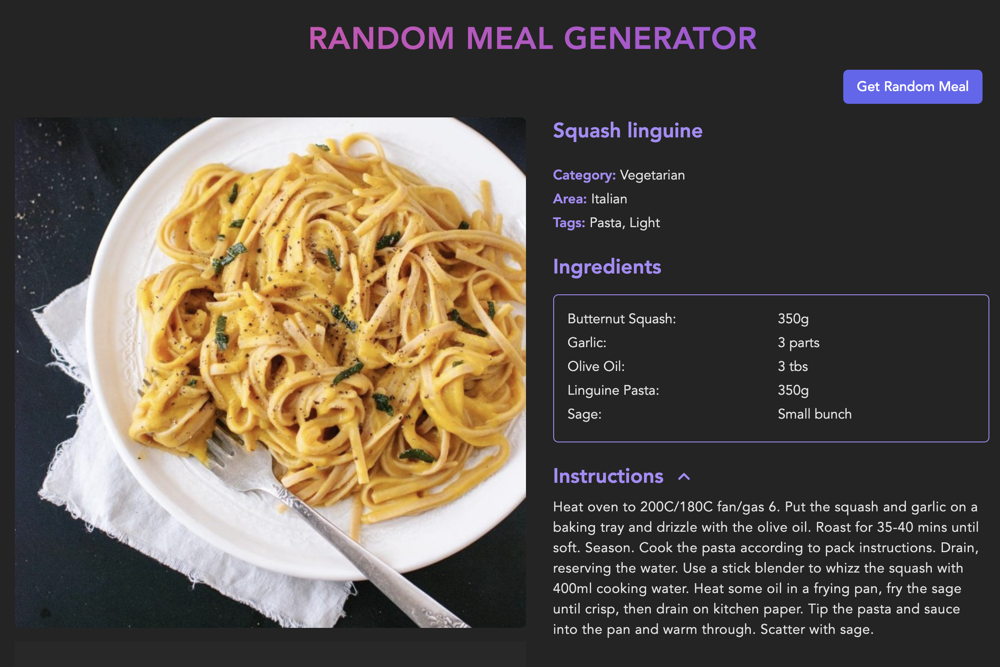

# Random Meal Generator - Backend

Random Meal Generator - Backend. Created with MongoDB, Mongoose, Express, nodemon, Railway.

[Live Demo](https://random-meal-generator-ruddy.vercel.app/) 👈

## Repositories

Frontend: https://github.com/Dmitriy24S/random-meal-generator

Backend: https://github.com/Dmitriy24S/random-meal-generator-backend
